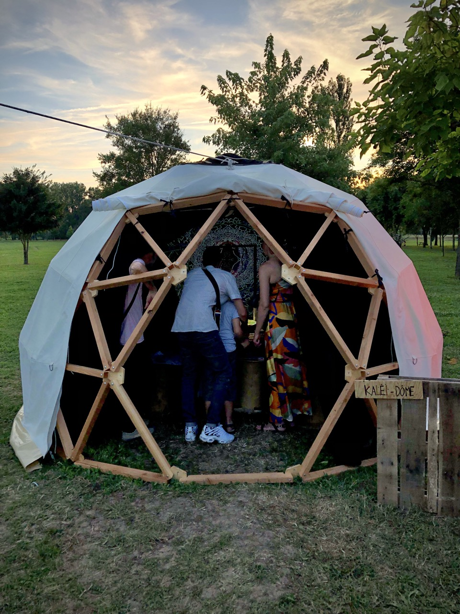

# Essaimage et Sobriété Numérique

### Vers une réplicabilité possible des installations numériques ?

[**Introduction**](#introduction)

[**Contexte**](#contexte-contexte)

[- Périmètres](#périmètres)

[- Terrain d’étude](#terrain-détude)

[- Public visé](#public-visé)

[- Contribution et évolution](#contribution-et-évolution)

[- Pour quels enjeux ?](#pour-quels-enjeux)

[- Notre démarche, nos valeurs](#notre-démarche-nos-valeurs)

---

# **Introduction**

Artistes du spectacle vivant (théâtre musique et danse) et des arts numériques, nous sommes [Collectif Or Normes](https://collectifornormes.fr/spectaclescollectifornormes/), basés à Poitiers. Nous produisons nos spectacles, nous les diffusons et réalisons également les modules de médiations qui s’y rattachent pour partager nos savoir-faire et compétences avec les publics. 

C’est dans ces valeurs que nous avons réalisé l’un de nos derniers projets, [*Le Village des Arts*](https://collectifornormes.fr/VillagedesArts/). Constitué de 6 dômes géodésiques, trois sur six sont consacrés à des installations numériques interactives et performatives (les trois autres étant réservés pour un spectacle), constituant le volet médiation de ce projet qui a été réalisé dans une démarche artistique et numérique. Une fois installées, les publics peuvent découvrir le dôme sonore, le dôme lumière et le dôme image, en présence de médiateur.s. et médiatrice.s. 

\#installations \#médiation \#méthodologie \#transmission 

# **Contexte**

Artistes et citoyen.ne.s [conscients des enjeux climatiques](#pour-quels-enjeux), nous avons répondu à l’appel à projet de la Région “ Essaimage et Sobriété Numérique “. Par le biais de notre candidature, nous souhaitons inscrire notre projet et mobiliser les membres de notre équipe dans ses réflexions pour identifier des manières de diffuser et de partager nos méthodologies de travail en contexte. Pourquoi ? Pour donner la possibilité à d’autres créateur.rice.s de répliquer nos process et ainsi, s’inscrire également dans une démarche d’éco-conception. 

\#partager \#diffuser \#ecoconcept 

## ***Périmètres***

Ces [trois installations](https://collectifornormes.fr/VillagedesArts/installations) présentes dans les dômes matérialisent les disciplines : [son](Dome-sonore), [image](Dome-kaleidoscope) et [lumière](Dome-lumineux) ; omniprésentes dans chacun de nos projets. Pourquoi réaliser ces installations ? Au fur et à mesure de nos rencontres et échanges avec les publics, nous nous sommes aperçus que le travail réalisé autour de ce qui est appelé “arts numériques “ est très peu connu. Or, nous sommes artistes du spectacle vivant **et** des arts numériques. Nous nous sommes donc lancés le défi de vulgariser nos pratiques par l'intermédiaire de ces dômes, ces derniers matérialisant également notre corpus d’étude et donc, notre terrain.  

\#médiation \#partage \#public  

##  ***Terrain d’étude***

Pour réaliser ces installations, nous avons prêté une attention particulière à leur conception tant en Hardware, en software, qu’en matériaux tangibles (bois, mobilier, quincaillerie, etc). Dans la rédaction de cette étude, nous souhaitons partager les processus de travail appliqués à la réalisation des installations en faisant part à la fois de l’expérience utilisateur, des besoins nécessaires à leur réalisation, de la faisabilité et de leur réplicabilité.

## ***Public visé***

En partageant notre méthodologie de création en contexte et en partageant avec les créateur.rice.s les prérequis pour répliquer, nous espérons qu’ensemble, nous puissions tendre vers un essaimage et une sobriété numérique accessible et pérenne.

\#createur.rice.s

## ***Contribution et évolution***

En prenant pour modèle la pratique de la communauté des développeur.se.s qui documente la programmation informatique et la méthodologie de travail qu’ils ont appliquée pour créer leur projet, notamment sur Github. À notre tour,  nous souhaitons partager les résultats obtenus après prototypages de nos installations et versions upgradées. C’est pourquoi, nous avons créé ce WIKI. Vous pouvez ainsi prendre connaissance du travail que nous avons réalisé, accéder à nos process et méthodologies en contexte. 

En vous connectant à cet espace, vous pouvez également documenter vos résultats et ainsi faire évoluer les différents process et méthodologie et participer à un essaimage des savoir et donc, tendre vers une sobriété numérique. Comment ? Parce qu’en ne partant pas de zéro, nous gagnons du temps et donc nous économisons de l’énergie. Nous pouvons également travailler la mutualisation de matériel et des collaborations entre artistes et créateur.rice.s. 

\#partageons \#mutualisons 

## ***Pour quels enjeux***

En prenant connaissance de plusieurs études, nous apprenons que le a un impact environnemental relativement important. 
>« En 2020, il représentait 2,1% à 3,9% des émissions mondiales de gaz à effet de serre mondiales (Explications sur l'empreinte environnementale du numérique). Si on fait le parallèle avec le secteur des transports, l'empreinte du numérique se situe entre celles de tous les avions du monde (environ 2%) et de tous les camions du monde (environ 4%) ([The Shift Project](https://theshiftproject.org/)). Sa part d'émissions grossit très vite. L'ADEME estimait qu'elle pourrait doubler d’ici 2025 (estimation antérieure à la crise de Covid-19). Outre les émissions de Gaz à Effet de Serre dont on parle beaucoup, les impacts sont massifs sur la consommation de ressources (entre autres les métaux), d’eau, et d’énergie, lors de la phase de fabrication (Empreinte environnementale du numérique mondial). » ([Source](https://beta.designersethiques.org/fr/thematique-ecoconception/guide-d-ecoconception/1-introduction))

Par conséquent, en partageant nos méthodes de travail, nous souhaitons réduire l’énergie consommée par nos appareils. Nous prêtons une attention particulière à ne pas acheter de devices non nécessaires, ainsi que le consommable. À partir des conseils partagés par F. Bordage, nous veillons à « *ne pas s’embarrasser de superflux*  », à « *mutualiser* » les appareils nécessaires à la création en recyclant et en reconditionnant et nous veillons à ce que nos créations « *vivent le plus longtemps possible* »en ne mettant pas à jour les logiciels, par exemple. ([Source](https://www.actes-sud.fr/catalogue/essais/tendre-vers-la-sobriete-numerique)) 

\#essaimage \#sobrietenumerique 

## ***Notre démarche, nos valeurs***

Pour la réalisation de ces trois installations présentes dans les trois dômes, nous avons prêté une attention particulière à ne pas suréquiper les dômes. 

Tout d’abord nous avons conçu l’ensemble des prototypes avec du matériel de récupération.  Par exemple, en rencontrant les habitants du territoire qui accueillent les dômes, certains d’entre eux avaient du matériel stocké depuis longtemps dans leur garage ou autre alors, ils nous l’ont donné pour réaliser nos installations (bois, quincaillerie, etc.).

Ensuite, nous donnons une seconde vie à notre équipement électronique.  Menant plusieurs projets artistiques et numériques, nous mutualisons le matériel des projets antécédents ou alors, nous louons le matériel que nous n’avons pas plutôt que de racheter de l’équipement.

[^1]:  Guide d'écoconception de services numériques, Aurélie Baton et Anne Faubry, février 2021, actualisé en septembre 2024\. [https://beta.designersethiques.org/fr/thematique-ecoconception/guide-d-ecoconception/1-introduction](https://beta.designersethiques.org/fr/thematique-ecoconception/guide-d-ecoconception/1-introduction), consulté le 26 novembre 2024\. 

[^2]:  Frédéric Bordage, *Tendre vers la sobriété numérique*, Paris, Actes Sud, coll. Je passe à l’acte, 2021, 64 pages
